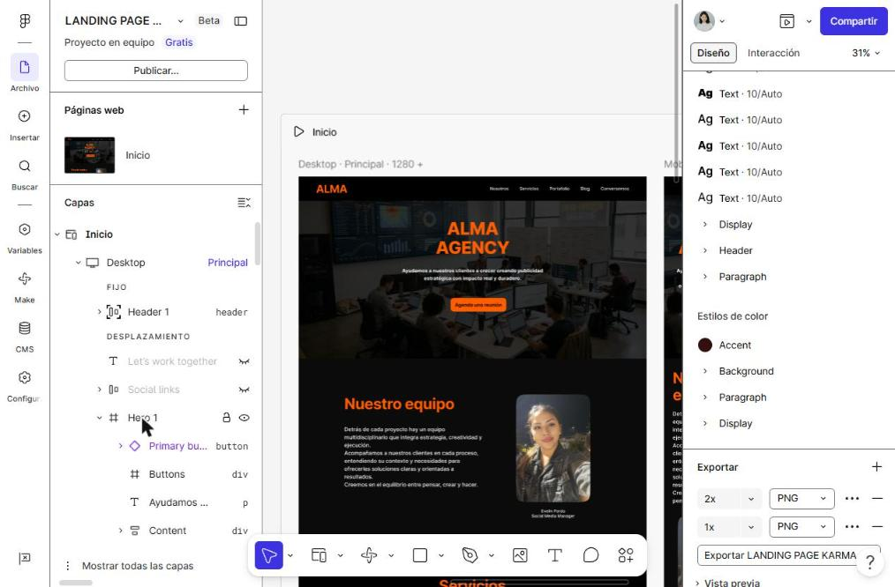

# Landing Page· Alma Agency

Landing page en versión de escritorio (1280 px), diseñada y maquetada en **Figma**.

[Ver archivo en Figma (solo lectura)](https://www.figma.com/site/HtPV8Yi0kyIUV08xesEX1q/LANDING-PAGE-KARMA-VER-ESCRITORIO)

## Qué se trabajó

**Estructura por secciones:** header, hero, equipo, servicios, proyectos, insights, contacto y footer, con capas ordenadas y nombradas.

**Auto layout** para que los bloques respeten espaciado y alineación.

**Componentes reutilizables** para las tarjetas de servicios y las fotos del equipo.

**Paleta consistente:** negro y naranja sobre fondos oscuros.

## Herramientas

Figma

## Autora

Rusmeri
